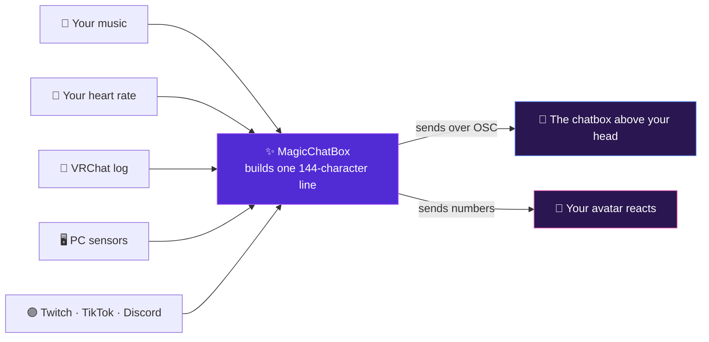

<div align="center">


# MagicChatBox

### **Your VRChat chatbox, but alive.**

Show the song you are playing, the lyrics as they happen, your heart rate, your world,<br>
your GPU temperature, your stream — all in one line, all customisable, all optional.

<br>

[](https://github.com/BoiHanny/vrcosc-magicchatbox/releases/latest)
[](https://github.com/BoiHanny/vrcosc-magicchatbox/releases)
[](https://github.com/BoiHanny/vrcosc-magicchatbox)
[](https://discord.gg/magicchatbox)
[](https://dotnet.microsoft.com/)

<br>

[](https://github.com/BoiHanny/vrcosc-magicchatbox/releases)
[](https://github.com/BoiHanny/vrcosc-magicchatbox/wiki)
[](https://discord.gg/magicchatbox)
[](https://www.virustotal.com/gui/file/9fbe32c6dc0f9a04e17ef780bdbe14a4034541fd377ceaf5aed1ace9e9c2909c/detection)

</div>

---

## 🪄 What it looks like in-game

VRChat gives you a **144-character** chatbox above your head. You pick which integrations fill it,
and MagicChatBox assembles them into one line.

Here is the same chatbox with four different setups — **the toggles on the left, what VRChat shows
on the right:**

<br>

**🎵 &nbsp;Music Display&nbsp; + &nbsp;Lyrics**

```text
▶ Ado — Show ♥        ♪ 世界中の誰よりきっと
```

<sub>The track you're playing, and the lyric line as it's sung.</sub>

<br>

**📡 &nbsp;VRChat Radar&nbsp; + &nbsp;Heart Rate&nbsp; + &nbsp;Time&nbsp; + &nbsp;Weather**

```text
👑 🌎 The Great Pug | 👥 24/40 | friends+ US-West     ♥ 82 bpm     21:41 CEST 🌧 14°C
```

<sub>Where you are, how full it is, your pulse, and your local time and weather.</sub>

<br>

**🖥️ &nbsp;Component Stats&nbsp; + &nbsp;Network&nbsp; + &nbsp;Tracker Battery**

```text
CPU 34% ¦ GPU 62°C ¦ RAM 41%      ↓ 842 Mbps      🔋 HMD 62% · L 41% · R 88%
```

<sub>Your rig at a glance — and a warning before a tracker dies mid-session.</sub>

<br>

**💭 &nbsp;Personal Status&nbsp; + &nbsp;Window Activity&nbsp; + &nbsp;Soundpad**

```text
💭 back in 5       On desktop ⁱⁿ Blender       🎶 'airhorn.mp3'
```

<sub>Your own message, what you're busy with, and the sound you just played.</sub>

<br>

> [!TIP]
> **Mix and match freely.** Every integration is an independent toggle, and each one has
> **separate VR and Desktop switches** — so your chatbox can show your specs at your desk and your
> heart rate in the headset, automatically.

**Run out of room?** MagicChatBox doesn't cut your text off mid-word. It drops the least important
pieces first — the queue, then the volume, then the device — and keeps the things you actually
care about, like the song title.

---

## ⚙️ How it works

**New to this? It's four steps, and MagicChatBox does three of them.**

<table>
<tr>
<td width="42"><b>1</b></td>
<td><b>It watches things on your PC.</b><br>
Your music player, your heart rate monitor, your GPU sensors, VRChat's own log file — whichever ones you switch on.</td>
</tr>
<tr>
<td><b>2</b></td>
<td><b>It builds one line of text.</b><br>
Everything enabled gets combined, in the order you choose, trimmed to fit VRChat's 144-character limit.</td>
</tr>
<tr>
<td><b>3</b></td>
<td><b>It sends that line to VRChat over OSC.</b><br>
OSC is just a simple messaging system that VRChat already supports — you only have to switch it on once, in VRChat's settings.</td>
</tr>
<tr>
<td><b>4</b></td>
<td><b>You do this part:</b> <a href="https://youtu.be/o1BdsEYfXqE?si=yn22oVxmPgmWriDm&t=130">turn OSC on in VRChat</a>. That's it — the chatbox above your head starts filling in.</td>
</tr>
</table>



### 🧍 The second arrow: your avatar can react

The same connection can send **numbers** to your avatar instead of text. If your avatar is set up
for it, your heart rate can drive a blush that deepens as your pulse rises, or a heart that beats
in time with the real thing.

You don't need this to use MagicChatBox — the chatbox works on its own. But if you build avatars,
it's there. See the [Heart Rate guide](https://github.com/BoiHanny/vrcosc-magicchatbox/wiki/%F0%9F%A9%B5-Heart-Rate)
for the full list of values you can hook up.

***


***

<table>
<tr><td width="60">1️⃣</td><td><a href="https://github.com/BoiHanny/vrcosc-magicchatbox/releases"><b>Download</b></a> the official ZIP from Releases</td></tr>
<tr><td>2️⃣</td><td><a href="https://dotnet.microsoft.com/en-us/download/dotnet/10.0"><b>Install the .NET 10 Desktop Runtime (Windows x64)</b></a> from Microsoft — pick <b>Desktop Runtime</b>, the plain ".NET Runtime" is not enough</td></tr>
<tr><td>3️⃣</td><td>Extract the ZIP into a folder</td></tr>
<tr><td>4️⃣</td><td>Run <b>MagicChatBox.exe</b></td></tr>
<tr><td>5️⃣</td><td>You're good to go!</td></tr>
</table>

> [!IMPORTANT]
> **You NEED to [ENABLE OSC](https://youtu.be/o1BdsEYfXqE?si=yn22oVxmPgmWriDm&t=130) inside VRChat in order to have the program working!**  
> Open your action menu with <kbd>R</kbd> → **Options** → **OSC** → **Enabled**.

> [!TIP]
> No headset? MagicChatBox works in **desktop mode** too — and it can run on a spare PC and send to a
> Quest over your network with [Standalone setup](https://github.com/BoiHanny/vrcosc-magicchatbox/wiki/Standalone).

> [!IMPORTANT]
> **We highly recommend reading our [Terms of Service](https://github.com/BoiHanny/vrcosc-magicchatbox/blob/master/Security.md) before you download or use MagicChatBox.**  
> It doesn't take long to get through the essential points, but it's important to understand how we value and protect your privacy, as well as the rules for using our software.

***


***

Every name below links to a full guide covering all of its settings.

<details open>
<summary><h3>🎵 &nbsp;Audio &nbsp;<sub><i>— what you're listening to, and what you're playing</i></sub></h3></summary>

| Integration | What it does |
| :------------ | :------------ |
| **[🎼 Music Display](https://github.com/BoiHanny/vrcosc-magicchatbox/wiki/%F0%9F%8E%BC-Music-Display)** | Shows whatever is playing on your PC — Spotify, YouTube, browsers, local players. No account needed. |
| **[Spotify](https://github.com/BoiHanny/vrcosc-magicchatbox/wiki/Spotify)** | Connects to Spotify directly for liked tracks, explicit flags, shuffle, repeat, device, volume and queue, with a template you write yourself. |
| **[Lyrics](https://github.com/BoiHanny/vrcosc-magicchatbox/wiki/Lyrics)** | Synced lyrics that follow the music, line by line, from LRCLIB or your own `.lrc` files. |
| **[Soundpad](https://github.com/BoiHanny/vrcosc-magicchatbox/wiki/Soundpad)** | Shows the sound you just played through Soundpad. |
| **[Voicemod](https://github.com/BoiHanny/vrcosc-magicchatbox/wiki/Voicemod)** | Your Voicemod soundboard on the Integrations page — fire a sound, switch voice, mute or hold-to-bleep without leaving VR, and show the room what you played. |

</details>

<details open>
<summary><h3>🙋 &nbsp;You &nbsp;<sub><i>— status, presence and vitals</i></sub></h3></summary>

| Integration | What it does |
| :------------ | :------------ |
| **[📐 Personal Status](https://github.com/BoiHanny/vrcosc-magicchatbox/wiki/%F0%9F%93%90-Personal-Status-Feature)** | Your own messages, cycled automatically, with AFK detection when you stop moving. |
| **[🪟 Window Activity](https://github.com/BoiHanny/vrcosc-magicchatbox/wiki/%F0%9F%AA%9F-Window-Activity)** | Shows whether you are in VR or on desktop, and which app you are focused on — with per-app privacy. |
| **[🩵 Heart Rate](https://github.com/BoiHanny/vrcosc-magicchatbox/wiki/%F0%9F%A9%B5-Heart-Rate)** | Live heart rate via Pulsoid, with statistics, trends and OSC parameters your avatar can react to. |
| **[Time](https://github.com/BoiHanny/vrcosc-magicchatbox/wiki/Time)** | Your local time and time zone — the most-asked question in any international instance. |
| **[Weather](https://github.com/BoiHanny/vrcosc-magicchatbox/wiki/Weather)** | Current conditions, humidity, wind and feels-like, sitting neatly next to the time. |

</details>

<details open>
<summary><h3>🖥️ &nbsp;Hardware & VR &nbsp;<sub><i>— your rig, at a glance</i></sub></h3></summary>

| Integration | What it does |
| :------------ | :------------ |
| **[Component Stats](https://github.com/BoiHanny/vrcosc-magicchatbox/wiki/Component-Stats)** | CPU, GPU, RAM and VRAM — usage, temperature, wattage, clocks and fan speed. |
| **[Network Statistics](https://github.com/BoiHanny/vrcosc-magicchatbox/wiki/Network-Statistics)** | Live download and upload rates, peaks, totals and utilisation. |
| **[VR Performance](https://github.com/BoiHanny/vrcosc-magicchatbox/wiki/VR-Performance)** | Frame rate, reprojection, dropped frames and GPU headroom from SteamVR — quiet until something goes wrong. |
| **[Tracker Battery](https://github.com/BoiHanny/vrcosc-magicchatbox/wiki/Tracker-Battery)** | Battery levels for your headset, controllers and full-body trackers, before one of them dies. |
| **[VRChat Radar](https://github.com/BoiHanny/vrcosc-magicchatbox/wiki/VRChat-Radar)** | World, instance, joins, leaves, screenshots and session stats, read from VRChat's own log. |

</details>

<details open>
<summary><h3>💬 &nbsp;Social & streaming &nbsp;<sub><i>— bring your audience in-world</i></sub></h3></summary>

| Integration | What it does |
| :------------ | :------------ |
| **[Discord](https://github.com/BoiHanny/vrcosc-magicchatbox/wiki/Discord)** | Your voice channel and who is talking — plus Rich Presence showing your VRChat world on Discord. |
| **[Twitch](https://github.com/BoiHanny/vrcosc-magicchatbox/wiki/Twitch)** | Live status, viewers, category and followers, with announcements and shoutouts you can send from VR. |
| **[TikTok Live](https://github.com/BoiHanny/vrcosc-magicchatbox/wiki/TikTok-Live)** | Follower counts, and live follows, gifts and milestones as they happen. |

</details>

<details>
<summary><h3>✨ &nbsp;More than integrations &nbsp;<sub><i>— click to expand</i></sub></h3></summary>

| Feature | What it does |
| :------------ | :------------ |
| **[Chatbox & Chatting](https://github.com/BoiHanny/vrcosc-magicchatbox/wiki/Chatbox-and-Chatting)** | Type straight into the VRChat chatbox, with live edit, autocomplete and history. |
| **[TTS & Voice](https://github.com/BoiHanny/vrcosc-magicchatbox/wiki/TTS-and-Voice)** | Speak your messages out loud, or dictate them with speech-to-text. |
| **[IntelliChat](https://github.com/BoiHanny/vrcosc-magicchatbox/wiki/IntelliChat)** | AI spelling, translation and shortening — for when your message will not fit in 144 characters. |
| **[Standalone](https://github.com/BoiHanny/vrcosc-magicchatbox/wiki/Standalone)** | Run it on a spare PC and send to a Quest over your network, no PCVR required. |
| **[App Options](https://github.com/BoiHanny/vrcosc-magicchatbox/wiki/App-Options)** | OSC ports, extra outputs, startup behaviour and global preferences. |

</details>

> [!IMPORTANT]
> **Heart Rate** requires an official `Pulsoid Member` subscription.  
> MagicChatBox users get **[15% off the Pulsoid BRO Plan](https://github.com/BoiHanny/vrcosc-magicchatbox/wiki/Unlock-a-15%25-Discount-on-Pulsoid's-BRO-Plan)**.

---

## 🔐 Your data stays yours

MagicChatBox never quietly starts reading things. To show your GPU temperature it has to read your
sensors; to show your music it has to read what Windows is playing. **So it asks first — and it asks
for one specific thing at a time, not blanket access.**

### How the permission prompt works

<table>
<tr>
<td width="42"><b>1</b></td>
<td>You switch on an integration — say <b>Component Stats</b>.</td>
</tr>
<tr>
<td><b>2</b></td>
<td>MagicChatBox asks for the one permission it needs, by name: <b>🖥️ Hardware Monitor</b>. Not "access to your computer" — just that.</td>
</tr>
<tr>
<td><b>3</b></td>
<td><b>Approve</b> and the integration starts. <b>Decline</b> and it switches itself back off, rather than running half-broken or asking again every launch.</td>
</tr>
<tr>
<td><b>4</b></td>
<td>Changed your mind? <b>Options → Privacy</b> lists every permission you've granted, and revoking one stops whatever depends on it.</td>
</tr>
</table>

### What each permission covers

| Permission | Used by |
| :------------ | :------------ |
| 🖥️ **Hardware Monitor** | Component Stats |
| 📋 **Window Activity** | Window Activity |
| 🎵 **Media Session** | Music Display |
| 💤 **AFK Sensor** | Personal Status |
| 🎮 **VR Tracker Battery** | Tracker Battery |
| 🎯 **VR Performance** | VR Performance |
| 📶 **Network Statistics** | Network Statistics |
| 🔊 **Soundpad Bridge** | Soundpad |
| 🎙️ **Voicemod Control** | Voicemod |
| 📡 **VRChat Log Reader** | VRChat Radar |
| 🌐 **Internet Access** | Spotify · Twitch · TikTok · Heart Rate · Lyrics · Weather |

### Most of it never leaves your PC

<div align="center">

| 🏠 Stays local | 🌐 Uses the network |
| :------------ | :------------ |
| Hardware sensors · Window titles · VRChat log<br>Media state · VR device batteries · Soundpad · Voicemod | Spotify · Twitch · TikTok<br>Pulsoid · Lyrics · Weather |

</div>

Only 🌐 **Internet Access** involves the network at all — and each integration that has it only ever
contacts **its own** service. Spotify talks to Spotify; Lyrics talks to LRCLIB. Nothing is pooled,
and nothing is sent anywhere else.

> [!NOTE]
> Two are worth a moment's thought before you enable them in a public instance. **Window Activity**
> reads window titles, which often contain document names or video titles — so it has per-app privacy
> settings and content filters. **VRChat Radar** reads who joins and leaves your instance; it stays on
> your PC, but it is other people's presence.

**[Read the full permissions breakdown →](https://github.com/BoiHanny/vrcosc-magicchatbox/wiki/Privacy-and-Permissions)**

***


***
> [!NOTE]
> **Our support team is here to assist you with any issues!**

<div align="center">

[](https://discord.gg/magicchatbox)

</div>

---

### 📚 Additional Resources

| | |
| :------------ | :------------ |
| 📖 **[Documentation](https://github.com/BoiHanny/vrcosc-magicchatbox/wiki)** | Guides for every integration and setting |
| ❓ **[FAQ](https://github.com/BoiHanny/vrcosc-magicchatbox/wiki/Frequently-Asked-Questions)** | Frequently asked questions and answers |
| 💬 **[Contact](https://discord.gg/magicchatbox)** | Create a support ticket on Discord |
| 👥 **[Staff](information/Staff.md)** | Meet the team behind MagicChatBox |
| ⭐ **[Rating](information/Rating.md)** | Our user ratings |
| 💜 **[Funding](information/Funding.md)** | Our community's advocates |

### Building with Voicemod Control

Voicemod's Control API needs a client key, which you request from Voicemod through
[their form](https://control-api.voicemod.net/getting-started/). There are two ways to supply one.

**In the app.** Open **Options → Voicemod → Client key**, paste the key and save it. It is stored with
Windows DPAPI for your Windows user only, and it takes priority over any key baked into the build. This
is the path for anyone running a build from source, and it needs no rebuild.

**At build time.** Pass the key as an MSBuild property so it is embedded as assembly metadata:

```
dotnet publish vrcosc-magicchatbox\MagicChatbox.csproj -c Release -r win-x64 --self-contained false -p:VoicemodClientKey=YOUR_KEY
```

Official releases do this from a repository secret named `VOICEMOD_CLIENT_KEY`, so the key never
reaches source control. Builds without a key still work — Voicemod control simply reports that no key
is configured until one is saved in Options.

---

## Legal Notice

> [!IMPORTANT]
> **Legal Notice**  
> MagicChatBox is released under a custom, source‑available proprietary license. Please review the following legal documents for important information regarding the use, modification, and distribution of MagicChatBox:
> 
> - **[Software License Agreement (SLA)](https://github.com/BoiHanny/vrcosc-magicchatbox/blob/master/License.md)**  
>   This agreement outlines the rights and restrictions for modifying, redistributing, or creating derivative works of MagicChatBox. Any modifications or forks must include this SLA and the accompanying Terms of Service.
> 
> - **[Terms of Service (TOS)](https://github.com/BoiHanny/vrcosc-magicchatbox/blob/master/Security.md)**  
>   These terms govern your conduct and usage of MagicChatBox. By running the software, you agree to abide by these Terms, which help maintain a respectful, safe, and lawful user experience.
> 
> By using MagicChatBox, you confirm that you have read, understood, and agree to be bound by these legal documents. If you do not agree, you are not permitted to use the software.

---

<div align="center">

*Thank you for choosing MagicChatBox – we hope it enhances your VRChat experience!*

<sub>Made with 💜 by <b>BoiHanny</b> and the MagicChatBox community</sub>

</div>
