# 🛂 Staff of MagicChatbox

`Here you can find all official Team-Members of MagicChatbox.`

```mermaid
graph TB;
    A["**FOUNDER**<br>BoiHanny"]:::black --> B["**HEAD OF ADMINISTRATION**<br>Lyrikidionisos"]:::darkred4;
    B --> C1["**ADMINISTRATOR**<br>ItsByMe"]:::brightred;
    B --> C2["**ADMINISTRATOR**<br>Ralph"]:::brightred;
    B --> C3["**ADMINISTRATOR**<br>ChineseName"]:::brightred;
    B --> C4["**ADMINISTRATOR**<br>IzuruBae"]:::brightred;
    C1 --> G["**STAFF OF MAGICLABS**"]:::staff;
    C2 --> G;
    C3 --> G;
    C4 --> G;
    G --> D["**DEVELOPER**"]:::developer;
    G --> E["**MODERATION**"]:::moderation;
    D --> D1["**ʜᴇᴀᴅ ᴏғ ᴅᴇᴠᴇʟᴏᴘᴍᴇɴᴛ**<br>Franxx"]:::developerText;
    D1 --> H["**TRANSLATOR**"]:::translator;
    D --> D2["**ᴅᴇᴠᴇʟᴏᴘᴇʀ**<br>❔"]:::developerName;
    D --> D3["**ᴅᴇᴠᴇʟᴏᴘᴇʀ**<br>❔"]:::developerName;
    D --> D4["**ᴅᴇᴠᴇʟᴏᴘᴇʀ**<br>❔"]:::developerName;
    D --> D5["**ᴅᴇᴠᴇʟᴏᴘᴇʀ**<br>❔"]:::developerName;
    D5 --> I["**CONTENT**"]:::newGroup;
    E --> E1["**ʜᴇᴀᴅ ᴏғ ᴍᴏᴅᴇʀᴀᴛɪᴏɴ**<br>miss_crystal"]:::moderationText;
    E1 --> F["**SUPPORT**"]:::supporter;
    E --> E2["**ᴍᴏᴅᴇʀᴀᴛᴏʀ**<br>❔"]:::moderationName;
    E --> E3["**ᴍᴏᴅᴇʀᴀᴛᴏʀ**<br>❔"]:::moderationName;
    E --> E4["**ᴍᴏᴅᴇʀᴀᴛᴏʀ**<br>❔"]:::moderationName;
    E --> E5["**ᴍᴏᴅᴇʀᴀᴛᴏʀ**<br>❔"]:::moderationName;
    E5 --> J["**VRC CONTRIBUTOR**"]:::nummer;
    F --> F1["**sᴜᴘᴘᴏʀᴛᴇʀ**<br>❔"]:::supporterName;
    F --> F2["**sᴜᴘᴘᴏʀᴛᴇʀ**<br>❔"]:::supporterName;
    F --> F3["**sᴜᴘᴘᴏʀᴛᴇʀ**<br>❔"]:::supporterName;
    F --> F4["**sᴜᴘᴘᴏʀᴛᴇʀ**<br>❔"]:::supporterName;
    F --> F5["**sᴜᴘᴘᴏʀᴛᴇʀ**<br>❔"]:::supporterName;
    H --> H1["**ᴛʀᴀɴsʟᴀᴛᴏʀ**<br>❔"]:::translatorName;
    H --> H2["**ᴛʀᴀɴsʟᴀᴛᴏʀ**<br>❔"]:::translatorName;
    H --> H3["**ᴛʀᴀɴsʟᴀᴛᴏʀ**<br>❔"]:::translatorName;
    H --> H4["**ᴛʀᴀɴsʟᴀᴛᴏʀ**<br>❔"]:::translatorName;
    H --> H5["**ᴛʀᴀɴsʟᴀᴛᴏʀ**<br>❔"]:::translatorName;
    I --> I1["**ᴄᴏɴᴛᴇɴᴛ**<br>❔"]:::newGroupName;
    I --> I2["**ᴄᴏɴᴛᴇɴᴛ**<br>❔"]:::newGroupName;
    I --> I3["**ᴄᴏɴᴛᴇɴᴛ**<br>❔"]:::newGroupName;
    I --> I4["**ᴄᴏɴᴛᴇɴᴛ**<br>❔"]:::newGroupName;
    I --> I5["**ᴄᴏɴᴛᴇɴᴛ**<br>❔"]:::newGroupName;
    J --> J1["**ᴠʀᴄ ᴄᴏɴᴛʀɪʙᴜᴛᴏʀ**<br>❔"]:::nummerName;
    J --> J2["**ᴠʀᴄ ᴄᴏɴᴛʀɪʙᴜᴛᴏʀ**<br>❔"]:::nummerName;
    J --> J3["**ᴠʀᴄ ᴄᴏɴᴛʀɪʙᴜᴛᴏʀ**<br>❔"]:::nummerName;
    J --> J4["**ᴠʀᴄ ᴄᴏɴᴛʀɪʙᴜᴛᴏʀ**<br>❔"]:::nummerName;
    J --> J5["**ᴠʀᴄ ᴄᴏɴᴛʀɪʙᴜᴛᴏʀ**<br>❔"]:::nummerName;

    classDef red fill:#ffcccc,stroke:#ff0000,stroke-width:2px,color:#000000,font-weight:bold;
    classDef darkred fill:#cc0000,stroke:#990000,stroke-width:2px,color:#000000,font-weight:bold;
    classDef darkred2 fill:#990000,stroke:#660000,stroke-width:2px,color:#000000,font-weight:bold;
    classDef darkred4 fill:#330000,stroke:#ff0000,stroke-width:2px,color:#ffffff,font-weight:bold;
    classDef black fill:#000000,stroke:#000000,stroke-width:2px,color:#ffffff,font-weight:bold;
    classDef group fill:#e0e0e0,stroke:#000000,stroke-width:2px,color:#000000,font-weight:bold;
    classDef developer fill:#b3e5fc,stroke:#00bcd4,stroke-width:2px,color:#000000,font-weight:bold;
    classDef moderation fill:#a5d6a7,stroke:#388e3c,stroke-width:2px,color:#000000,font-weight:bold;
    classDef supporter fill:#7986cb,stroke:#7e57c2,stroke-width:2px,color:#000000,font-weight:bold;
    classDef translator fill:#fff9c4,stroke:#ff9800,stroke-width:2px,color:#000000,font-weight:bold;
    classDef newGroup fill:#e0f7fa,stroke:#006064,stroke-width:2px,color:#000000,font-weight:bold;
    classDef nummer fill:#e1bee7,stroke:#8e24aa,stroke-width:2px,color:#000000,font-weight:bold;
    classDef developerName color:#ffffff,font-weight:bold;
    classDef moderationName color:#ffffff,font-weight:bold;
    classDef supporterName color:#ffffff,font-weight:bold;
    classDef translatorName color:#ffffff,font-weight:bold;
    classDef newGroupName color:#ffffff,font-weight:bold;
    classDef nummerName color:#ffffff,font-weight:bold;
    classDef developerText color:#00bcd4,font-weight:bold;
    classDef moderationText color:#388e3c,font-weight:bold;
    classDef staff fill:#808080,stroke:#505050,stroke-width:2px,color:#000000,font-weight:bold;
    classDef brightred fill:#b13838,stroke:#990000,stroke-width:2px,color:#ffffff,font-weight:bold;
```

## About the Team

### ◥◣ BoiHanny (aka. Hanny)
- Administrator

  - I’m a passionate technology strategist/solutions architect with 7 years of experience officially working in IT. Before that, I spent time working on smaller projects to fund my journey into the world of development, and now I specialize in building cutting-edge tools with technologies like C#, .NET, and Azure.

### ◥◣ Lyrikidionisos (aka. Ethan)
- Administrator
  - I have specialized experience in legal topics for 2 years and have worked as an administrator for 5 years, focusing on Java/Python/Lua and server management across various networks. Additionally, I have 1 year of experience as a former Content Relation Administrator for Hypixel.net. I hold a C1 level in International English and possess advanced skills in cybersecurity, cloud computing, and network architecture.

