# 🛂 Organisation

`Here you can find all official Team-Members of MagicChatbox.`

```mermaid
graph TB;
    A["**FOUNDER**<br>BoiHanny"]:::black --> B["**CHIEF ADMINISTRATOR**<br>Lyrikidionisos"]:::darkred4;
    B --> C1["**ADMINISTRATOR**<br>ItsByMe"]:::brightred;
    B --> C3["**ADMINISTRATOR**<br>中文姓名"]:::brightred;
    C1 --> G["**STAFF OF MAGICLABS**"]:::staff;
    C2 --> G;
    C3 --> G;
    C4 --> G;
    G --> D["**DEVELOPER**"]:::developer;
    G --> E["**MODERATION**"]:::moderation;
    D --> D1["**ʜᴇᴀᴅ ᴏғ ᴅᴇᴠᴇʟᴏᴘᴍᴇɴᴛ**<br>Franxx"]:::developerText;
    D1 --> H["**TRANSLATOR**"]:::translator;
    D --> D2["**ᴅᴇᴠᴇʟᴏᴘᴇʀ**<br>❔"]:::developerName;
    D --> D3["**ᴅᴇᴠᴇʟᴏᴘᴇʀ**<br>❔"]:::developerName;
    D --> D4["**ᴅᴇᴠᴇʟᴏᴘᴇʀ**<br>❔"]:::developerName;
    D --> D5["**ᴅᴇᴠᴇʟᴏᴘᴇʀ**<br>❔"]:::developerName;
    D5 --> I["**CONTENT**"]:::newGroup;
    E --> E1["**ʜᴇᴀᴅ ᴏғ ᴍᴏᴅᴇʀᴀᴛɪᴏɴ**<br>miss_crystal"]:::moderationText;
    E1 --> F["**SUPPORT**"]:::supporter;
    E --> E2["**ᴍᴏᴅᴇʀᴀᴛᴏʀ**<br>❔"]:::moderationName;
    E --> E3["**ᴍᴏᴅᴇʀᴀᴛᴏʀ**<br>❔"]:::moderationName;
    E --> E4["**ᴍᴏᴅᴇʀᴀᴛᴏʀ**<br>❔"]:::moderationName;
    E --> E5["**ᴍᴏᴅᴇʀᴀᴛᴏʀ**<br>❔"]:::moderationName;
    E5 --> J["**VRC CONTRIBUTOR**"]:::nummer;
    F --> F1["**sᴜᴘᴘᴏʀᴛᴇʀ**<br>❔"]:::supporterName;
    F --> F2["**sᴜᴘᴘᴏʀᴛᴇʀ**<br>❔"]:::supporterName;
    F --> F3["**sᴜᴘᴘᴏʀᴛᴇʀ**<br>❔"]:::supporterName;
    F --> F4["**sᴜᴘᴘᴏʀᴛᴇʀ**<br>❔"]:::supporterName;
    F --> F5["**sᴜᴘᴘᴏʀᴛᴇʀ**<br>❔"]:::supporterName;
    H --> H1["**ᴛʀᴀɴsʟᴀᴛᴏʀ**<br>❔"]:::translatorName;
    H --> H2["**ᴛʀᴀɴsʟᴀᴛᴏʀ**<br>❔"]:::translatorName;
    H --> H3["**ᴛʀᴀɴsʟᴀᴛᴏʀ**<br>❔"]:::translatorName;
    H --> H4["**ᴛʀᴀɴsʟᴀᴛᴏʀ**<br>❔"]:::translatorName;
    H --> H5["**ᴛʀᴀɴsʟᴀᴛᴏʀ**<br>❔"]:::translatorName;
    I --> I1["**ᴄᴏɴᴛᴇɴᴛ**<br>❔"]:::newGroupName;
    I --> I2["**ᴄᴏɴᴛᴇɴᴛ**<br>❔"]:::newGroupName;
    I --> I3["**ᴄᴏɴᴛᴇɴᴛ**<br>❔"]:::newGroupName;
    I --> I4["**ᴄᴏɴᴛᴇɴᴛ**<br>❔"]:::newGroupName;
    I --> I5["**ᴄᴏɴᴛᴇɴᴛ**<br>❔"]:::newGroupName;
    J --> J1["**ᴠʀᴄ ᴄᴏɴᴛʀɪʙᴜᴛᴏʀ**<br>❔"]:::nummerName;
    J --> J2["**ᴠʀᴄ ᴄᴏɴᴛʀɪʙᴜᴛᴏʀ**<br>❔"]:::nummerName;
    J --> J3["**ᴠʀᴄ ᴄᴏɴᴛʀɪʙᴜᴛᴏʀ**<br>❔"]:::nummerName;
    J --> J4["**ᴠʀᴄ ᴄᴏɴᴛʀɪʙᴜᴛᴏʀ**<br>❔"]:::nummerName;
    J --> J5["**ᴠʀᴄ ᴄᴏɴᴛʀɪʙᴜᴛᴏʀ**<br>❔"]:::nummerName;

    classDef red fill:#ffcccc,stroke:#ff0000,stroke-width:2px,color:#000000,font-weight:bold;
    classDef darkred fill:#cc0000,stroke:#990000,stroke-width:2px,color:#000000,font-weight:bold;
    classDef darkred2 fill:#990000,stroke:#660000,stroke-width:2px,color:#000000,font-weight:bold;
    classDef darkred4 fill:#330000,stroke:#ff0000,stroke-width:2px,color:#ffffff,font-weight:bold;
    classDef black fill:#000000,stroke:#000000,stroke-width:2px,color:#ffffff,font-weight:bold;
    classDef group fill:#e0e0e0,stroke:#000000,stroke-width:2px,color:#000000,font-weight:bold;
    classDef developer fill:#b3e5fc,stroke:#00bcd4,stroke-width:2px,color:#000000,font-weight:bold;
    classDef moderation fill:#a5d6a7,stroke:#388e3c,stroke-width:2px,color:#000000,font-weight:bold;
    classDef supporter fill:#7986cb,stroke:#7e57c2,stroke-width:2px,color:#000000,font-weight:bold;
    classDef translator fill:#fff9c4,stroke:#ff9800,stroke-width:2px,color:#000000,font-weight:bold;
    classDef newGroup fill:#e0f7fa,stroke:#006064,stroke-width:2px,color:#000000,font-weight:bold;
    classDef nummer fill:#e1bee7,stroke:#8e24aa,stroke-width:2px,color:#000000,font-weight:bold;
    classDef developerName color:#ffffff,font-weight:bold;
    classDef moderationName color:#ffffff,font-weight:bold;
    classDef supporterName color:#ffffff,font-weight:bold;
    classDef translatorName color:#ffffff,font-weight:bold;
    classDef newGroupName color:#ffffff,font-weight:bold;
    classDef nummerName color:#ffffff,font-weight:bold;
    classDef developerText color:#00bcd4,font-weight:bold;
    classDef moderationText color:#388e3c,font-weight:bold;
    classDef staff fill:#808080,stroke:#505050,stroke-width:2px,color:#000000,font-weight:bold;
    classDef brightred fill:#b13838,stroke:#990000,stroke-width:2px,color:#ffffff,font-weight:bold;
```

_We are planning to fill 80% of our capacity this year!_

## About the Lead

### ◥◣ ${\color{magenta}𝗙𝗢𝗨𝗡𝗗𝗘𝗥}$ ${\color{Gray}•}$ BoiHanny ${\color{darkGray}𝑎𝑘𝑎. \space 𝐻𝑎𝑛𝑛𝑦}$

  - I’m a passionate technology strategist/solutions architect with 7 years of experience officially working in IT. Before that, I spent time working on smaller projects to fund my journey into the world of development, and now I specialize in building cutting-edge tools with technologies like C#, .NET, and Azure.

### ◥◣ ${\color{RubineRed}𝗖𝗛𝗜𝗘𝗙 \space 𝗔𝗗𝗠𝗜𝗡𝗜𝗦𝗧𝗥𝗔𝗧𝗢𝗥}$ ${\color{Gray}•}$ Lyrikidionisos ${\color{darkGray}𝑎𝑘𝑎. \space 𝐸𝑡ℎ𝑎𝑛}$

  - I have specialized experience in legal topics for 2 years and have worked as an administrator for 5 years, focusing on Java/Lua/Phyton and server management across various networks. Additionally, I have 1 year of experience as a former Administrator. I hold a C1 level in International Business English and possess advanced skills in cybersecurity, cloud computing, network architecture, and expertise in personnel management.
 
### ◥◣ ${\color{Red}𝗔𝗗𝗠𝗜𝗡𝗜𝗦𝗧𝗥𝗔𝗧𝗢𝗥}$ ${\color{Gray}•}$ ItsByMe 
  - Hi, for the past three years, I’ve been working on the technical side of things, helping to bring this amazing program to life. You’ll often find me online in public lobbies, where I love interacting with the community. I’m fluent in English and have extensive experience with Unity, Blender, and C#.

### ◥◣ ${\color{Red}𝗔𝗗𝗠𝗜𝗡𝗜𝗦𝗧𝗥𝗔𝗧𝗢𝗥}$ ${\color{Gray}•}$ 中文姓名
  - Not much is known about him. He has emerged in the management team, leaving us unsure whether to fear or revere him. He possesses strong competencies in English and community management. Additionally, he has a knack for solving complex problems with innovative solutions, making him a valuable yet enigmatic figure in our organization.

### ◥◣ ${\color{cyan}𝗛𝗘𝗔𝗗 \space 𝗢𝗙 \space 𝗗𝗘𝗩𝗘𝗟𝗢𝗣𝗠𝗘𝗡𝗧}$ ${\color{Gray}•}$ Franxx
  - Hi, I’m Franxx, the Head of Development at MagicChatbox. I have an excellent English proficiency at the B2 level. As a developer and contributor to MagicChatbox, I bring over three years of experience in C#, Unity, Python, Java, and Lua. I’m the second point of contact for program development after Hanny, and I specialize in bug fixing and managing pull requests.
 
### ◥◣ ${\color{ForestGreen}𝗛𝗘𝗔𝗗 \space 𝗢𝗙 \space 𝗠𝗢𝗗𝗘𝗥𝗔𝗧𝗜𝗢𝗡}$ ${\color{Gray}•}$ miss_crystal
  - Hi, I’m Crystal, the Head of Moderation at MagicChatbox. I’ve been with the team for a year now. I started as a regular user and was brought onto the team due to my dedication in helping other users with their issues. I’m well-versed in the regulations and troubleshooting for MagicChatbox. My main focus is on support and moderation, where I’m most active. I also have native-level proficiency in English.
