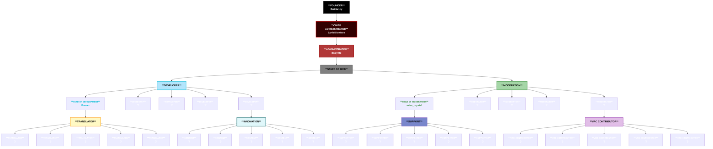

# 🛂 Organisation

`Here you can find all official Team-Members of MagicChatbox.`

```mermaid
graph TB;
    A["**FOUNDER**<br>BoiHanny"]:::black --> B["**CHIEF ADMINISTRATOR**<br>Lyrikidionisos"]:::darkred4;
    B --> C1["**ADMINISTRATOR**<br>ItsByMe"]:::brightred;
    C1 --> G["**STAFF OF MCB**"]:::staff;
    G --> D["**DEVELOPER**"]:::developer;
    G --> E["**MODERATION**"]:::moderation;
    D --> D1["**ʜᴇᴀᴅ ᴏғ ᴅᴇᴠᴇʟᴏᴘᴍᴇɴᴛ**<br>Franxx"]:::developerText;
    D1 --> H["**TRANSLATOR**"]:::translator;
    D --> D2["**ᴅᴇᴠᴇʟᴏᴘᴇʀ**<br>❔"]:::developerName;
    D --> D3["**ᴅᴇᴠᴇʟᴏᴘᴇʀ**<br>❔"]:::developerName;
    D --> D4["**ᴅᴇᴠᴇʟᴏᴘᴇʀ**<br>❔"]:::developerName;
    D --> D5["**ᴅᴇᴠᴇʟᴏᴘᴇʀ**<br>❔"]:::developerName;
    D5 --> I["**INNOVATION**"]:::newGroup;
    E --> E1["**ʜᴇᴀᴅ ᴏғ ᴍᴏᴅᴇʀᴀᴛɪᴏɴ**<br>miss_crystal"]:::moderationText;
    E1 --> F["**SUPPORT**"]:::supporter;
    E --> E2["**ᴍᴏᴅᴇʀᴀᴛᴏʀ**<br>❔"]:::moderationName;
    E --> E3["**ᴍᴏᴅᴇʀᴀᴛᴏʀ**<br>❔"]:::moderationName;
    E --> E4["**ᴍᴏᴅᴇʀᴀᴛᴏʀ**<br>❔"]:::moderationName;
    E --> E5["**ᴍᴏᴅᴇʀᴀᴛᴏʀ**<br>❔"]:::moderationName;
    E5 --> J["**VRC CONTRIBUTOR**"]:::nummer;
    F --> F1["**sᴜᴘᴘᴏʀᴛᴇʀ**<br>❔"]:::supporterName;
    F --> F2["**sᴜᴘᴘᴏʀᴛᴇʀ**<br>❔"]:::supporterName;
    F --> F3["**sᴜᴘᴘᴏʀᴛᴇʀ**<br>❔"]:::supporterName;
    F --> F4["**sᴜᴘᴘᴏʀᴛᴇʀ**<br>❔"]:::supporterName;
    F --> F5["**sᴜᴘᴘᴏʀᴛᴇʀ**<br>❔"]:::supporterName;
    H --> H1["**ᴛʀᴀɴsʟᴀᴛᴏʀ**<br>❔"]:::translatorName;
    H --> H2["**ᴛʀᴀɴsʟᴀᴛᴏʀ**<br>❔"]:::translatorName;
    H --> H3["**ᴛʀᴀɴsʟᴀᴛᴏʀ**<br>❔"]:::translatorName;
    H --> H4["**ᴛʀᴀɴsʟᴀᴛᴏʀ**<br>❔"]:::translatorName;
    H --> H5["**ᴛʀᴀɴsʟᴀᴛᴏʀ**<br>❔"]:::translatorName;
    I --> I1["**ᴄᴏɴᴛᴇɴᴛ**<br>❔"]:::newGroupName;
    I --> I2["**ᴄᴏɴᴛᴇɴᴛ**<br>❔"]:::newGroupName;
    I --> I3["**ᴄᴏɴᴛᴇɴᴛ**<br>❔"]:::newGroupName;
    I --> I4["**ᴄᴏɴᴛᴇɴᴛ**<br>❔"]:::newGroupName;
    I --> I5["**ᴄᴏɴᴛᴇɴᴛ**<br>❔"]:::newGroupName;
    J --> J1["**ᴠʀᴄ ᴄᴏɴᴛʀɪʙᴜᴛᴏʀ**<br>❔"]:::nummerName;
    J --> J2["**ᴠʀᴄ ᴄᴏɴᴛʀɪʙᴜᴛᴏʀ**<br>❔"]:::nummerName;
    J --> J3["**ᴠʀᴄ ᴄᴏɴᴛʀɪʙᴜᴛᴏʀ**<br>❔"]:::nummerName;
    J --> J4["**ᴠʀᴄ ᴄᴏɴᴛʀɪʙᴜᴛᴏʀ**<br>❔"]:::nummerName;
    J --> J5["**ᴠʀᴄ ᴄᴏɴᴛʀɪʙᴜᴛᴏʀ**<br>❔"]:::nummerName;

    classDef red fill:#ffcccc,stroke:#ff0000,stroke-width:2px,color:#000000,font-weight:bold;
    classDef darkred fill:#cc0000,stroke:#990000,stroke-width:2px,color:#000000,font-weight:bold;
    classDef darkred2 fill:#990000,stroke:#660000,stroke-width:2px,color:#000000,font-weight:bold;
    classDef darkred4 fill:#330000,stroke:#ff0000,stroke-width:2px,color:#ffffff,font-weight:bold;
    classDef black fill:#000000,stroke:#000000,stroke-width:2px,color:#ffffff,font-weight:bold;
    classDef group fill:#e0e0e0,stroke:#000000,stroke-width:2px,color:#000000,font-weight:bold;
    classDef developer fill:#b3e5fc,stroke:#00bcd4,stroke-width:2px,color:#000000,font-weight:bold;
    classDef moderation fill:#a5d6a7,stroke:#388e3c,stroke-width:2px,color:#000000,font-weight:bold;
    classDef supporter fill:#7986cb,stroke:#7e57c2,stroke-width:2px,color:#000000,font-weight:bold;
    classDef translator fill:#fff9c4,stroke:#ff9800,stroke-width:2px,color:#000000,font-weight:bold;
    classDef newGroup fill:#e0f7fa,stroke:#006064,stroke-width:2px,color:#000000,font-weight:bold;
    classDef nummer fill:#e1bee7,stroke:#8e24aa,stroke-width:2px,color:#000000,font-weight:bold;
    classDef developerName color:#ffffff,font-weight:bold;
    classDef moderationName color:#ffffff,font-weight:bold;
    classDef supporterName color:#ffffff,font-weight:bold;
    classDef translatorName color:#ffffff,font-weight:bold;
    classDef newGroupName color:#ffffff,font-weight:bold;
    classDef nummerName color:#ffffff,font-weight:bold;
    classDef developerText color:#00bcd4,font-weight:bold;
    classDef moderationText color:#388e3c,font-weight:bold;
    classDef staff fill:#808080,stroke:#505050,stroke-width:2px,color:#000000,font-weight:bold;
    classDef brightred fill:#b13838,stroke:#990000,stroke-width:2px,color:#ffffff,font-weight:bold;
```

_We are planning to fill the capacity this year!_

## About the Lead

### ◥◣ 𝗙𝗢𝗨𝗡𝗗𝗘𝗥 • BoiHanny 𝑎𝑘𝑎. 𝐻𝑎𝑛𝑛𝑦

  - I’m a passionate technology strategist/solutions architect with 7 years of experience officially working in IT. Before that, I spent time working on smaller projects to fund my journey into the world of development, and now I specialize in building cutting-edge tools with technologies like C#, .NET, and Azure.

### ◥◣ 𝗔𝗗𝗠𝗜𝗡𝗜𝗦𝗧𝗥𝗔𝗧𝗢𝗥 • Lyrikidionisos 𝑎𝑘𝑎. 𝐸𝑡ℎ𝑎𝑛

  - I have two years of specialized experience in legal matters and five years of experience as an administrator, with a focus on Java, Lua, Python, and server management across multiple networks. In addition, I hold a degree in Business Development and have three years of professional experience in this field. I am certified at C1 level in International Business English and bring advanced expertise in cybersecurity, cloud computing, network architecture, as well as strong skills in personnel management.
 
### ◥◣ 𝗔𝗗𝗠𝗜𝗡𝗜𝗦𝗧𝗥𝗔𝗧𝗢𝗥 • ItsByMe 
  - Hi, for the past three years, I’ve been working on the technical side of things, helping to bring this amazing program to life. You’ll often find me online in public lobbies, where I love interacting with the community. I’m fluent in English and have extensive experience with Unity, Blender, and C#.
